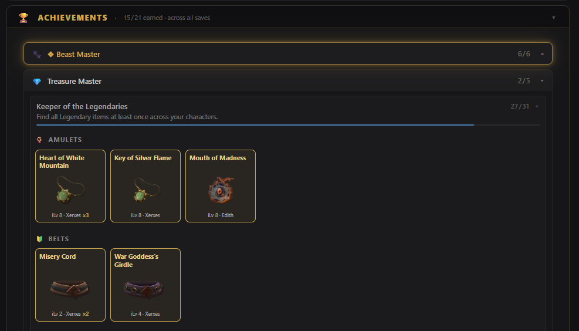

# Darkhaven (Demo) Character Browser

An unofficial fan-made save file inspector for [Darkhaven](https://moonbeastgame.com).


## How to use

1. Open `index.html` in **Chrome, Edge, Opera, Brave or Firefox**
2. Click **Scan Save Folder** and select your Darkhaven save directory
3. Your characters load automatically — click any character card to view details

Your save folder is typically at:
```
%APPDATA%\LocalLow\MoonBeast Production\Darkhaven Demo\Save
```

> **Note:** Chrome/Edge/Opera/Brave remember the folder between sessions and can rescan automatically. Firefox re-prompts for the folder on every page load (browser limitation — no persistent folder access in Firefox).

No installation, no server, no internet connection required. Everything runs locally in the browser.

> **Unofficial fan tool** — not affiliated with or endorsed by Moon Beast Productions.

---

## Features

**Character overview**
- Class, level, and XP progress bar
- Attributes: Strength, Dexterity, Vitality, Magic (base + intrinsic + item bonuses)
- Combat stats: Attack, Armor, Crit Chance, Crit Resistance, Penetration, Resistances
- Resources: Life and Mana bars with current/max values, Mana Regen, Stamina, Flask charges
- Detailed stats: Attack Speed, Cast Speed, Move Speed, Magic Find, Gold Find, Item Find

**Paperdoll**
- Full equipment layout with item art
- Socket overlays showing socketed gems, hearts, and runes using their actual in-game images
- Hover any item for a full tooltip — affixes, sockets, requirements, legendary text

**Stash**


- Grid view: 15×16 stash grid with accurate item sizes and positions, item art, rarity borders
- List view: sorted/filterable item list with thumbnails
- Core/Heart cells coloured by rarity (Common, Elite, Champion, Unique)
- Item socket support, including socketed items
- Favourite item tag support
- Full item tooltips on hover

**Skills**

- All three skill branches with current levels, tome bonuses, and global skill bonuses from rings
- Skill upgrade cards showing unlocked options
- Tooltips with descriptions and upgrade effects
- Panel can be collapsed/expanded, state saved between sessions

**Tattoos (Rune Garments)**

- All rune garment slots with equipped runes and their socket effects
- Panel can be collapsed/expanded, state saved between sessions

**Kill Log**

- Top killed monsters with counts, sortable by kills, Rarity, and Monsters
- Panel can be collapsed/expanded, state saved between sessions

**Achievements**

- Fan-curated achievement system tracking progress across all loaded save files
- Categories: Beast Master, Treasure Master, Ink Master, Skill Master, Survivor
- Each achievement shows a progress bar and earned status
- Expandable tracking grids for:
  - **Hunter Extraordinaire** — every monster species × rarity combination
  - **Owner of All the Hearts** — every heart source mob × rarity tier (N/E/C/U dots)
  - **Keeper of the Legendaries** — full legendary item catalogue with found/not-found status and hover tooltips
- Fully mastered categories show a gold glow effect on the category card
- Collapse/expand state saved between sessions

**Multi-save support**
- Loads all `.max` save files from a folder (and subfolders) at once
- Groups saves by character, shows most recent per character by default
- Configurable limit (default: 20 saves per character) to keep loading fast

---

## Files

| File | Purpose | Required |
|------|---------|----------|
| `index.html` | App shell and layout | Yes |
| `app.js` | UI rendering, tooltip system, stash grid, achievement rendering | Yes |
| `app.css` | Main style definitions for page appearance | Yes |
| `maxparser.js` | `.max` save file parser — decompression, stat extraction, item resolution | Yes |
| `maxguids.js` | Blueprint GUID dictionary for all known entities in the Demo save format | Yes |
| `gamedata.js` | Game constants — stats, slots, heart/legendary/gem data, display name maps | Yes |
| `achievements.js` | Achievement definitions and heart/beast catalogues — pure data, edit here to add achievements | Yes |
| `skills.js` | Skill and skill upgrade definitions | Yes |
| `skills.md` | Skill documentation. Not needed to run, documentation only. | No |
| `darkhaven_save_format.md` | Analysis of the `.max` save format and its GUIDs (Demo version). Not needed to run, documentation only. | No |

## Folder structure
| Folder | Contents | File pattern |
|--------|----------|--------------|
| `img/cores` | Heart images | `core_{rarity}_{element}_heart.png` |
| `img/dyes` | Dye images | `{name}_dye.png` |
| `img/gems` | Gem images | `gem_{type}_{nr}.png` — `01` Cracked · `02` Flawed · `03` Dull |
| `img/items` | Item images | `{a/l/j/s/w}_{name}.png` — legendary items use `.webp` |
| `img/runes` | Rune images | `rune{nr}_{name}.png` — `01`–`05` |
| `img/skills` | Skill & upgrade images | `skill_{option}_{name}.png` |
| `img/tomes` | Tome images | `tome_of_{name}.png` |


> **Adding or replacing images:** Place images in the appropriate `img/` subfolder following the naming convention, e.g. for `items`
> (`a_` = armor, `j_` = jewelry, `s_` = shield, `w_` = weapon, `l_` = legendary `.webp`).
> The app will load them automatically on the next scan.

---

## Limitations

- **Folder memory:** Chrome/Edge/Brave/Opera remember the save folder across sessions via the File System Access API. Firefox always re-prompts for the folder on page load.
- Save format is reverse-engineered and may break after game updates
- Some item names and stats may be missing or approximate for newer content
- Heart source names for newly added monsters depend on their blueprint name being present in `maxguids.js` — update that file when new GUIDs become available

---

## Notice

See [NOTICE.md](NOTICE.md) for attribution and IP information. Game content belongs to Moon Beast Productions. No affiliation implied.
